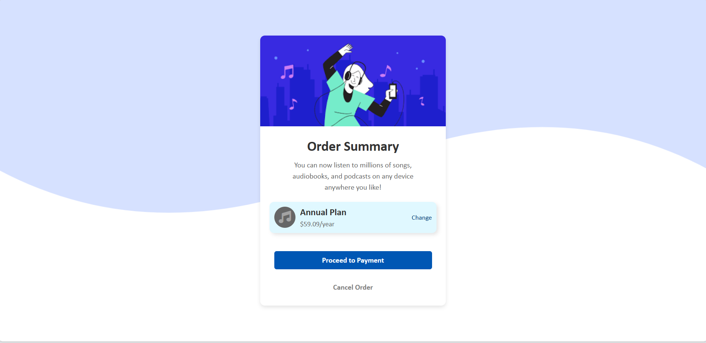
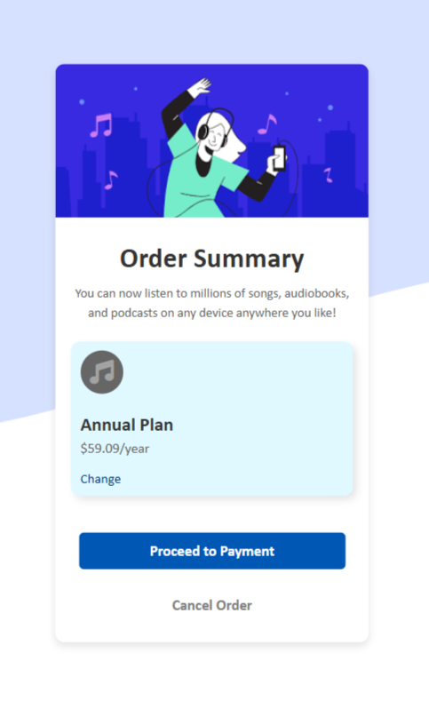

# Order Summary Project

## Overview

The Order Summary project is a responsive web application designed to display a clean and modern order summary card. Users can view their selected plan, its price, and options to proceed with payment or cancel the order. The application is built using HTML and CSS, ensuring compatibility across various devices, including desktops and mobile devices.

## Screenshots

### Laptop View

### Mobile View

## Features

- Responsive design that adapts to different screen sizes.
- Clean and modern UI for an intuitive user experience.
- Includes an order summary card with:
  - Plan details
  - Price information
  - Action buttons (Proceed to Payment, Cancel Order)
  - A change link for modifying the selected plan

## Technologies Used

- HTML5
- CSS3
- Font Awesome (for icons)
